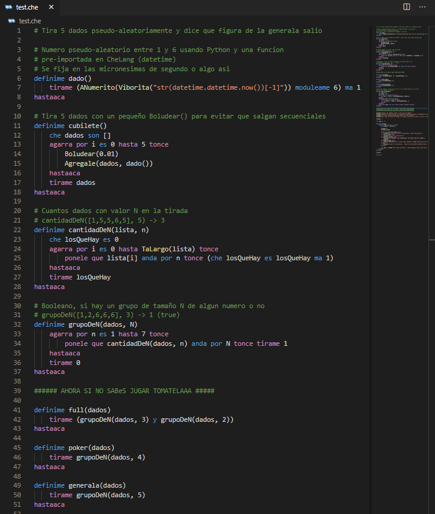

## Extension para VSCode que da soporte básico al lenguaje CheLang (https://github.com/frankdilu/CheLang)

## Features

- Agrega el icono de la bandera argenta a los archivos .che

  Para el resto de los iconos, usa el theme "seti".

- Syntax highlight (muy basico por ahora)

- Soporte de folding

## Ejemplo

## Pendientes

- Syntax highlight de estructuras (funciones, ciclos, variables). Por ahora solo reconoce keywords, constantes, strings y comentarios) 

- Intellisense

- Snippets

- Autoindentation

- Language Server
